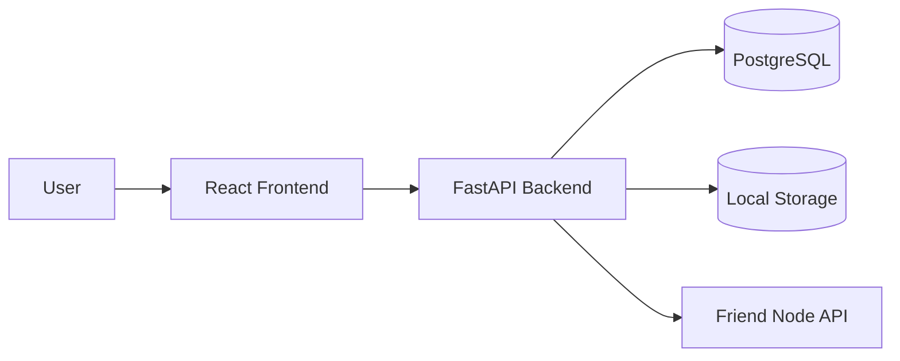
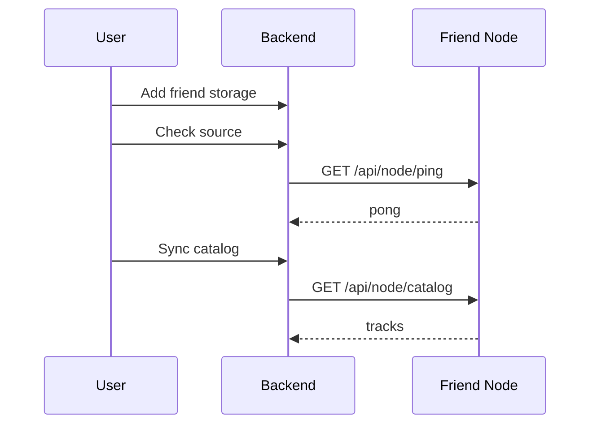
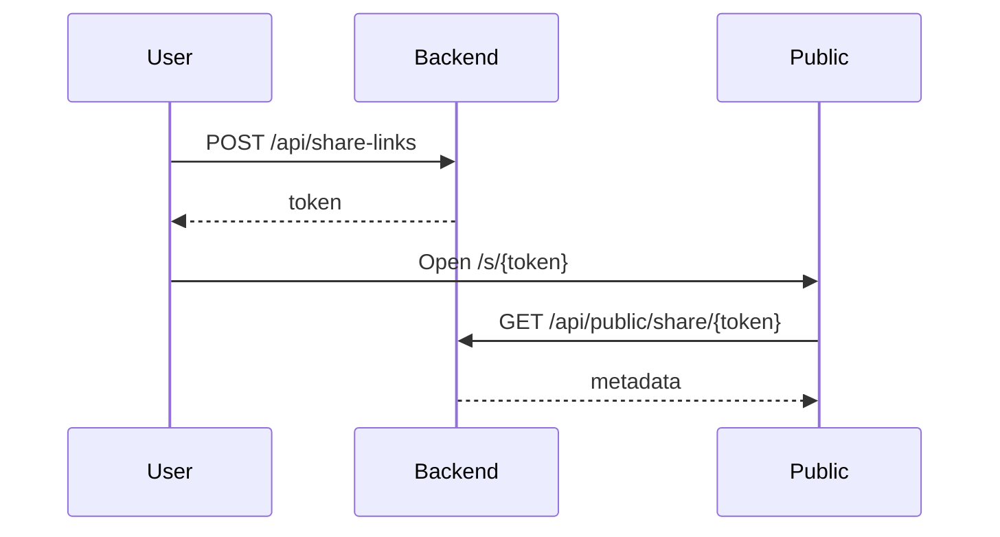
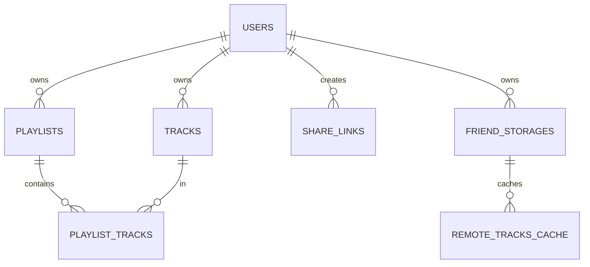
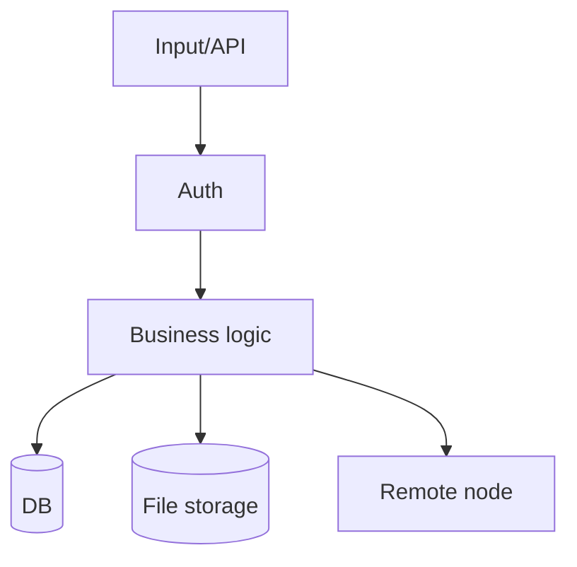
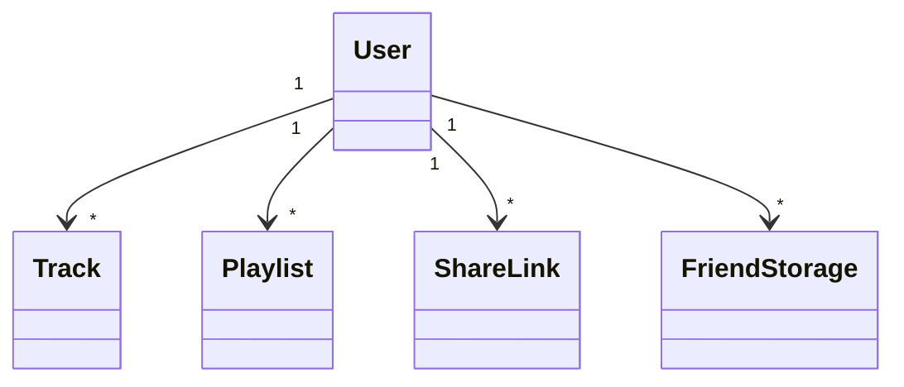
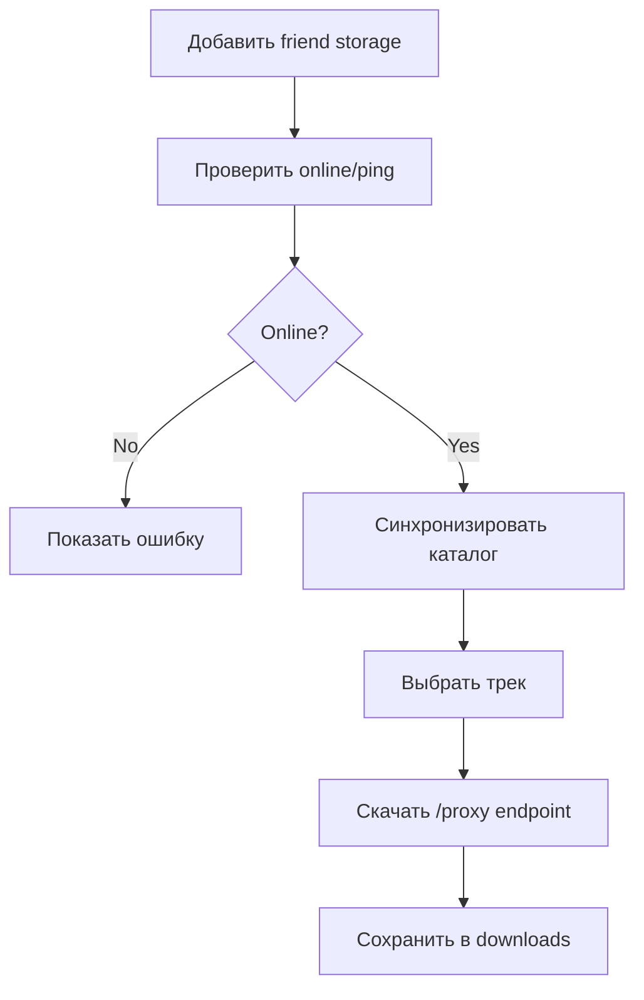

# Диаграммы (Mermaid)

```mermaid
flowchart LR
U[User] --> FE[React Frontend]
FE --> BE[FastAPI Backend]
BE --> DB[(PostgreSQL)]
BE --> FS[(Local Storage)]
BE --> FN[Friend Node API]
```

```mermaid
sequenceDiagram
participant U as User
participant BE as Backend
participant FN as Friend Node
U->>BE: Add friend storage
U->>BE: Check source
BE->>FN: GET /api/node/ping
FN-->>BE: pong
U->>BE: Sync catalog
BE->>FN: GET /api/node/catalog
FN-->>BE: tracks
```

```mermaid
sequenceDiagram
participant U as User
participant BE as Backend
U->>BE: POST /api/share-links
BE-->>U: token
U->>Public: Open /s/{token}
Public->>BE: GET /api/public/share/{token}
BE-->>Public: metadata
```

```mermaid
erDiagram
USERS ||--o{ TRACKS : owns
USERS ||--o{ PLAYLISTS : owns
PLAYLISTS ||--o{ PLAYLIST_TRACKS : contains
TRACKS ||--o{ PLAYLIST_TRACKS : in
USERS ||--o{ SHARE_LINKS : creates
USERS ||--o{ FRIEND_STORAGES : owns
FRIEND_STORAGES ||--o{ REMOTE_TRACKS_CACHE : caches
```

```mermaid
flowchart TD
A[Input/API] --> B[Auth]
B --> C[Business logic]
C --> D[(DB)]
C --> E[(File storage)]
C --> F[Remote node]
```

```mermaid
classDiagram
class User
class Track
class Playlist
class ShareLink
class FriendStorage
User "1" --> "*" Track
User "1" --> "*" Playlist
User "1" --> "*" ShareLink
User "1" --> "*" FriendStorage
```

```mermaid
flowchart TD
S[Добавить friend storage] --> C[Проверить online/ping]
C --> Y{Online?}
Y -->|No| E[Показать ошибку]
Y -->|Yes| SYNC[Синхронизировать каталог]
SYNC --> SEL[Выбрать трек]
SEL --> DL[Скачать /proxy endpoint]
DL --> END[Сохранить в downloads]
```
