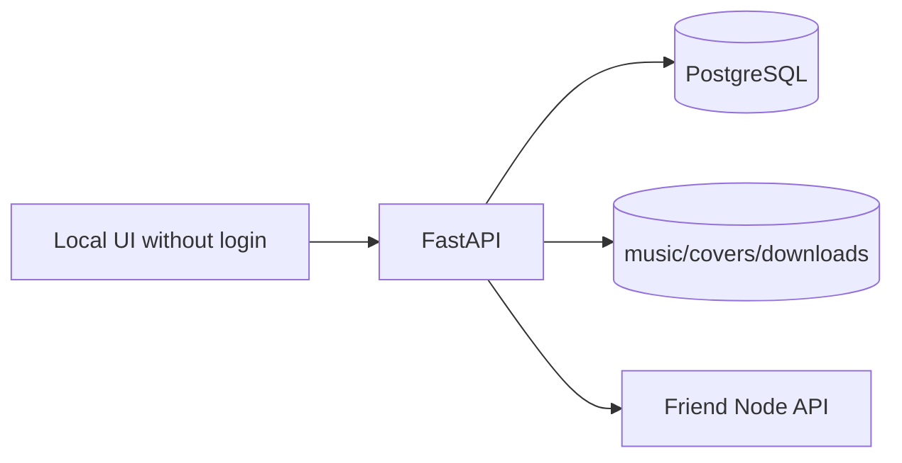
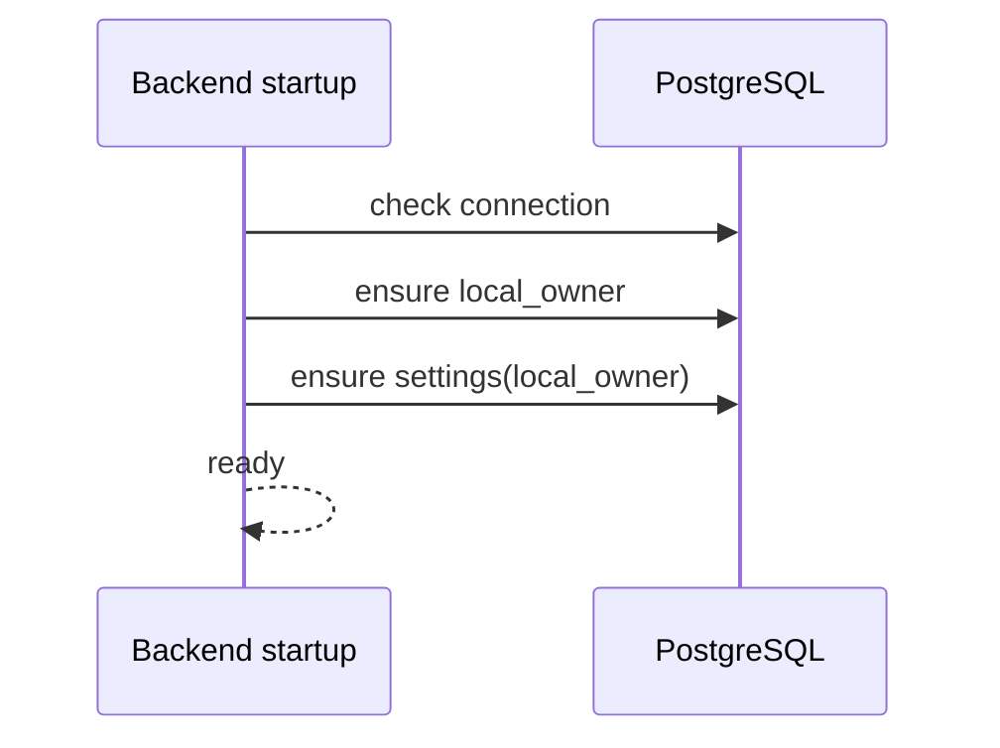
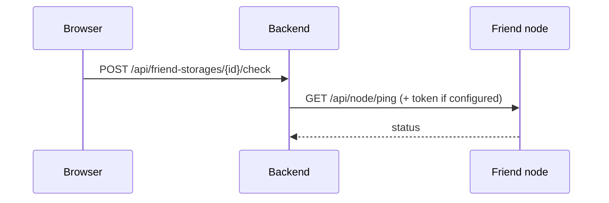

# Диаграммы

```mermaid
flowchart LR
UI[Local UI without login] --> API[FastAPI]
API --> DB[(PostgreSQL)]
API --> FS[(music/covers/downloads)]
API --> NODE[Friend Node API]
```

```mermaid
sequenceDiagram
participant BE as Backend startup
participant DB as PostgreSQL
BE->>DB: check connection
BE->>DB: ensure local_owner
BE->>DB: ensure settings(local_owner)
BE-->>BE: ready
```

```mermaid
sequenceDiagram
participant U as Browser
participant BE as Backend
participant FN as Friend node
U->>BE: POST /api/friend-storages/{id}/check
BE->>FN: GET /api/node/ping (+ token if configured)
FN-->>BE: status
```
